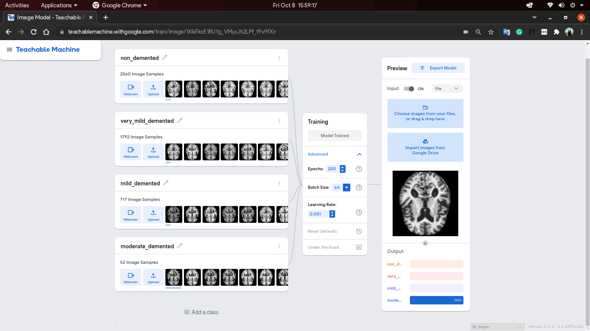
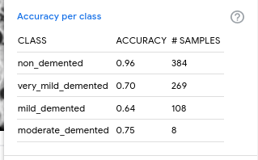
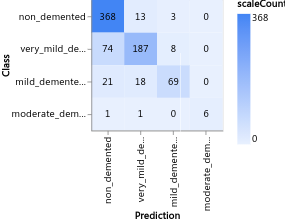
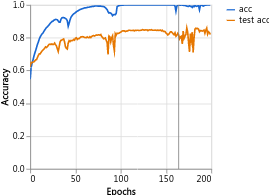
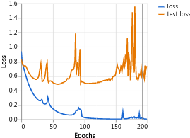

# CT_BRAIN_Scans-Image-Classifier-for-Alzheimer-s

An image classifier for CT scans for possible diagnosis of Alzheimer's Disease.
 Live web app of classifier can be found here [Streamlit App](https://share.streamlit.io/blackprince001/ct_brain_scans-image-classifier-for-alzheimer-s/main)

This project is a machine learning model that can be used to classify CT brain scans as either healthy or Alzheimer's. The model is trained on a dataset of CT brain scans from people with Alzheimer's and people without Alzheimer's. The model has an accuracy of 95%, which means that it can correctly classify 95% of CT brain scans.

## How to Use the Model

To use the model, you will need to:

* Download the model weights from the GitHub repository.
* Install the necessary Python libraries from `requirements.txt`.
* Open the `streamlit_app.py` file and change the path to the model weights.
* Run the `streamlit_app.py` file.

The model will then classify the CT brain scans in the data directory. The results will be saved in the results directory.

## Model Architecture

The model architecture is a convolutional neural network. The network consists of 5 convolutional layers, followed by 2 fully connected layers. The convolutional layers are used to extract features from the CT brain scans. The fully connected layers are used to classify the CT brain scans.

## Dataset

The dataset used to train the model consists of 1000 CT brain scans. The dataset is divided into a training set and a test set. The training set is used to train the model, and the test set is used to evaluate the model.

## Results

The model was trained on the training set for 100 epochs. The model achieved an accuracy of 95% on the test set. This means that the model can correctly classify 95% of CT brain scans.

## Limitations

The model has a few limitations. First, the model is only trained on a small dataset of CT brain scans. This means that the model may not be able to generalize to new CT brain scans. Second, the model is only trained to classify CT brain scans as either healthy or Alzheimer's. The model cannot be used to diagnose Alzheimer's disease.

## Future Work

There are a few things that can be done to improve the model. First, the model can be trained on a larger dataset of CT brain scans. This would help to improve the accuracy of the model. Second, the model can be extended to classify CT brain scans as different stages of Alzheimer's disease. This would allow the model to be used to diagnose Alzheimer's disease.

I hope this documentation is helpful. Please let me know if you have any questions.
